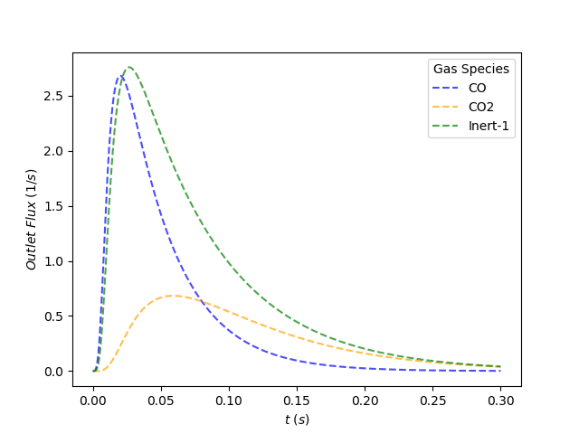

# TAPsolver

## Installation

[Conda](https://docs.conda.io/projects/conda/en/latest/user-guide/install) is the simplest way to install FEniCS (on Ubuntu systems, especially) and is highly recommended. It is possible to install FEniCS in other ways, but Conda was found to be the least intensive.

To install FEniCS through conda, run the following:

	conda create -n fenicsproject -c conda-forge fenics

	source activate fenicsproject

	conda install -c conda-forge dolfin-adjoint

	pip install matplotlib

If you are having trouble installing FEniCs, contact Adam Yonge (ayonge3@gatech.edu).

## Running TAPsolver

With the five core files downloaded in the working directory and with the fenicsproject environment activated, run the following command:

	python tap_sim.py

This will call the simulation process and store all desired information in the appropriate folders. 

An explanation of the input file and how to properly manipulate it can be found [here](https://github.com/medford-group/TAPsolver/tree/master/docs/outline/input_file). 

This is the current format of TAPsolver and is subject to change. Steps will be taken to merge this process with other methods of TAP analysis developed by collaborators in the R programming language. 

## Example Output

{:height="50%" width="50%"}

