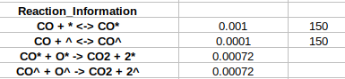
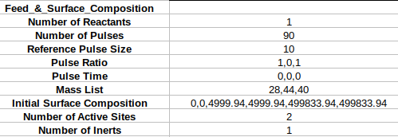

* [Overview](https://github.com/medford-group/TAPsolver/tree/master)
* [Installation](https://github.com/medford-group/TAPsolver/tree/master/docs/resources/installation)
* [Interface options](https://github.com/medford-group/TAPsolver/tree/master/docs/resources/interfaceOptions)
* [Documentation](https://github.com/medford-group/TAPsolver/tree/master/docs/resources/input_file)
* [Questions & Development](https://github.com/medford-group/TAPsolver/tree/master/docs/resources/questionsDiscussion)

# Carbon Moxide Adsorption TAP Simulation

How to generate synthetic data for CO adsorption on a catalyst surface is outlined below. Adjustments to multiple pulses and multiple active sites are also discussed. The first two sections should be straight forward, but the later two could be confusing.

## Defining the Reactor

Basic reactor parameters must be defined by the user, including the 'reactor length', 'radius', 'catalyst zone fraction', 'inert/catalyst void fraction' and 'reactor temperature'. The user must also define parameters that control the precision of the simulator, including time steps and mesh size. Values of 500 for each should be acceptable for simple reactions (like CO adsorption) and reasonable pulse durations.

The diffusion for each species is determined through scaling to some reference species. If it is known, the user can enter the diffusion information in 'Reference Temperature', 'Reference Diffusion Inert', 'Reference Diffusion Catalyst' and 'Reference Temperature rows'.

Each time the simulation is run, a folder will be generated to store the results. The name of this folder (and its location) can be specified by 'Output Folder Name'. Similarly, if you plan on processing some experimental data (or previously generated synthetic data), you can specify its location by the 'Experimental Data Folder' variable. 

*Section of the input_file.csv file that details the reactor setup and some simulation details*

## Data Storage and Simulation Options

It is possible to specify what processes are desired during a particular simulation and what should be stored after these processes have occured. This can be done in the 'Data Storage Options' section, where the user can enter 'TRUE' or 'FALSE' for each of the options. For example, if the user would like to perform a sensitivity analysis, but try to fit parameters, they would set 'Sensitivity Analysis' to 'TRUE' and 'Fit Parameters' to 'FALSE'. Details for the remaining options are listed [here](https://github.com/medford-group/TAPsolver/tree/master/docs/resources/input_file). 

*Section of the input_file.csv file that details data storage options*

## Feed & Surface Composition / Reaction Information 

This section is where things can be a little more confusing. In particular, listing the elementary reactions in the micro-kinetic model and specifying inputs like 'Pulse Ratio', 'Pulse Time', 'Mass List' and 'Initial Surface Composition'.

### Entering Elementary Reactions

Elementary Reactions (E.R.) follow a general trend:

- Species_1 + Species_2 -> Species_3 + Species_4

Where Species # can be any gas or surface species desired. There are two options for the arrow: either forward or reversible

- ->    : Irreversible E.R. 
- <->   : Reversible E.R.

The two cells directly to the right of each elementary reaction in the input_file.csv file allow the user to specify the forward and backward rate constants, with the backward rate constant always being listed after the forward rate constant. An error will be returned if the user defines a reversible reaction, but the backward rate constant is excluded. 

On each side of the elementary reaction ( left (Species_1 + Species_2) or right (Species_3 + Species_4) ), the components must always appear in the following order:

- Gas Species > Surface Species > Active Site

Examples include

- CO + *   and not   * + CO
- CO + O*   and not   O* + CO
- CO* + *   and not   * + CO*

If more than one of the species is involved in the elementary reaction, it can be specified with the addition of the number before the species. For example,

- 'O2 + 2* <-> 2O*'

This is due to the way the program handles elementary reactions is likely to become more flexible (and accesable) in the future.

An example the reaction information input section is presented below.

*Section of the input_file.csv file that details the elementary reactions*

It should be noted that this structure must be maintained for every elementary reaction. So no replacements can be made for the '+' or '->'.

### Gas and Surface Details

  

Defining the parameters for the gasses and initial surface composition depend on the order in which species appear in the elementary reactions (with the exception of active sites).

It will be easier to see with the help of some examples:

Example 1:

CO + * -> CO*

CO* + O* -> CO2 + 2*

The order of the gases would be CO, CO2, and then any included inerts.

So the gas inputs would look something like this:

Pulse Ratio:     1 (*CO*), 0 (*CO2*), 1 (*Inert-1*)

Mass List:       28 (*CO*), 44 (*CO2*), 40 (*Inert-1*)

Pulse Time:      0 (*CO*), 0 (*CO2*), 0 (*Inert-1*)

The surface species and active sites would appear as CO*, O*, and * . The Compostions would be defined as follows:

Initial Surface Composition:    0 (CO*), 4999833.9 (O*), 4999833.9 (*)

Example 2: 

A + * -> A*

A + ^ -> A^

C + 2* -> 2B*

B* + A* <-> D + 2*

B* + A^ <-> D + 2^

The order of the gases would be A, C, and D and then any included inerts.

So the gas inputs would look something like this:

Pulse Ratio:     1 (*A*), 1 (*C*), 0 (*D*), 1 (*Inert-1*)

Mass List:       10 (*A*), 20 (*C*), 30 (*D*), 40 (*Inert-1*)

Pulse Time:      0 (*A*), 0 (*C*), 0 (*D*), 0 (*Inert-1*)

The surface species and active sites would appear as A*, A^, B*, * and ^. The Compostions would be defined as follows:

Initial Surface Composition:    0 (A*), 0 (A^), 0 (B*), 10000 (*) and 5000 (^)

*Section of the input_file.csv file that details the gas and surface components*
