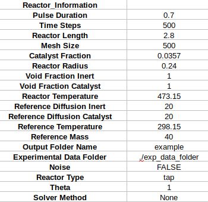

# Carbon Moxide Adsorption TAP Simulation

How to generate synthetic data for CO adsorption on a catalyst surface is outlined below. Adjustments to multiple pulses and multiple active sites are also discussed.

## Defining the Reactor

Basic reactor parameters must be defined by the user, including the reactor length, radius, catalyst zone fraction, inert/catalyst void fraction and reactor temperature. The user must also define parameters that control the precision of the simulator, including time steps, mesh size

The diffusion for each species is determined by scaling to some reference species. 

## Multi-pulse

## Multi-site

## Additional Reactions

## Sensitivity Analysis

## Parameter Fitting

